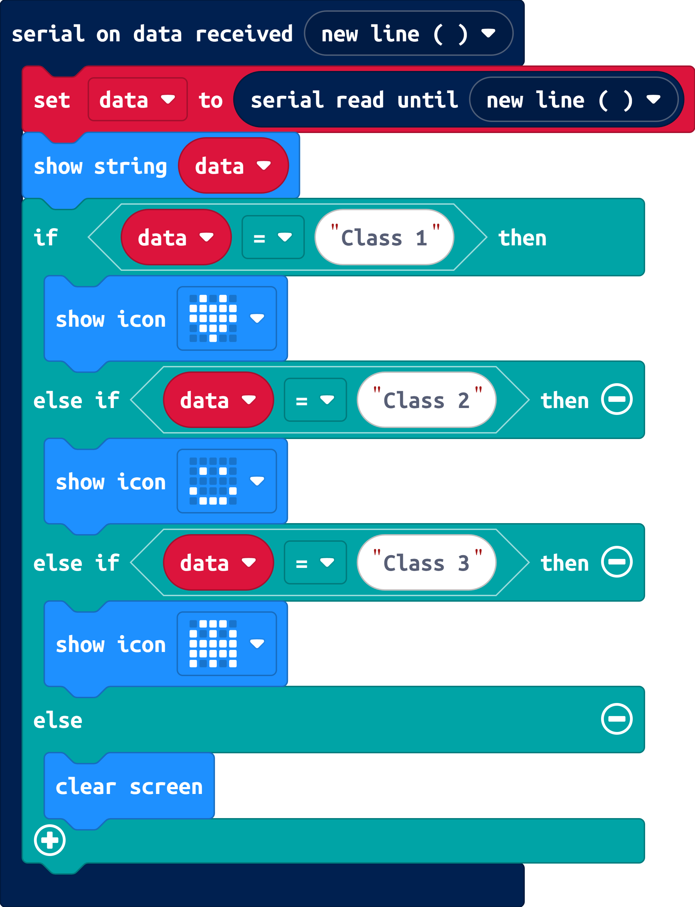

<div align="center" style="font-size: 2.5rem; font-weight: bold;">
  MachBit ⚡
</div>

---

**MachBit** is a web application project that connects an **AI Vision Model** from [Teachable Machine](https://teachablemachine.withgoogle.com/) to a **micro:bit** using the Web Serial API. It allows real-time control based on AI predictions using either webcam input or uploaded images.


## 🔗 Live Demo  
Access via GitHub Pages:  
👉 [https://your-username.github.io/machbit/](https://your-username.github.io/machbit/) *(Replace with your actual repo path)*


## 🔧 Features
- ✅ Predict using **Webcam** or **Image Upload**
- 🤖 Load models from **Teachable Machine** (public URL)
- 🔌 Connect with **micro:bit** via Web Serial API
- 📤 Send prediction results to micro:bit
- 💡 Beautiful UI with **SweetAlert2**
- 📊 Real-time prediction graph (supports multiple classes)


## 📁 Project Structure

```bash
machbit/
├── index.html           # Main web page
├── style.css            # Website styles
├── script.js            # Core logic (AI, webcam, micro:bit)
├── favicon.svg          # Icon
```

## 🚀 How to Use
1. Open the webpage via GitHub Pages (link above)
2. Enter your **Model URL** from Teachable Machine (must be public)
3. Click "LOAD AI MODEL"
4. Choose input mode:
   - 📁 Upload Image: Choose an image file from your device
   - 📷 Webcam: Use the webcam for real-time analysis
5. Click **CONNECT MICRO:BIT** to connect the device
6. The AI prediction result will be sent via Serial to the micro:bit


## ⚠️ Requirements
- Use a **browser that supports Web Serial API** (e.g. Chrome 89+)
- Allow camera access for webcam mode
- The micro:bit must be running code that can receive Serial input (e.g. Python or MakeCode)


## 🔽 Example Code for micro:bit
### 🐍 MicroPython (for micro:bit)
```python
from microbit import *
import music

while True:
    if uart.any():
        data = uart.read().decode('utf-8').strip()
        display.scroll(data)
        
        if data == "Class 1":
            display.show(Image.Heart)
        elif data == "Class 2":
            display.show(Image.HAPPY)
        elif data == "Class 3":
            display.show(Image.Ghost)
        else:
            display.clear()
```
### 💻 MakeCode (JavaScript)
```javascript
serial.onDataReceived(serial.delimiters(Delimiters.NewLine), function () {
    let data = serial.readUntil(serial.delimiters(Delimiters.NewLine))
    basic.showString(data)
    
    if (data == "Class 1") {
         basic.showIcon(IconNames.Heart)
    } else if (data == "Class 2") {
        basic.showIcon(IconNames.Happy)
    } else if (data == "Class 3") {
       basic.showIcon(IconNames.Ghost)
    } else {
        basic.clearScreen()
    }
})
```


### 🧱 MakeCode Blocks (Screenshots)


### 💡 How the Code Works:
- The micro:bit reads input sent via Web Serial from the MachBit web app.
- This input is a prediction result from the AI model such as `"Class 1"`, `"Class 2"`, or `"Class 3"`.
- The micro:bit displays an icon based on the received class:
  - `"Class 1"` → heart icon  
  - `"Class 2"` → happy face  
  - `"Class 3"` → ghost icon  
  - If the data doesn’t match any of these, the screen is cleared.

> 🔤 These class labels ("Class 1", "Class 2", etc.) come from your custom-trained model on Teachable Machine. You can rename or add more classes, just make sure to update the micro:bit code accordingly.

---

Happy Coding! ⚡️